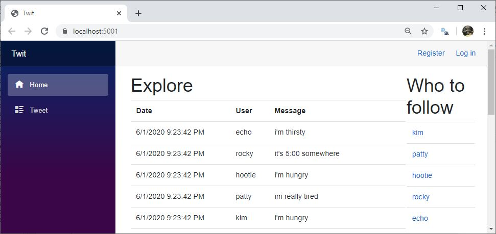

A very simple app showing how the RedisProvider can be used.

Twit is based on the Redis tutorials https://redis.io/topics/twitter-clone and https://redislabs.com/ebook/part-2-core-concepts/chapter-8-building-a-simple-social-network/.

The sample uses a local Redis instance. Download information is [here](https://redis.io/download).  Redis on Windows info is [here](https://redislabs.com/ebook/appendix-a/a-3-installing-on-windows/a-3-2-installing-redis-on-window/).

Modify the connection string in Startup.cs as needed for your Redis instance.

Run the SeedDb test to seed test data (after modifying the connection string).

